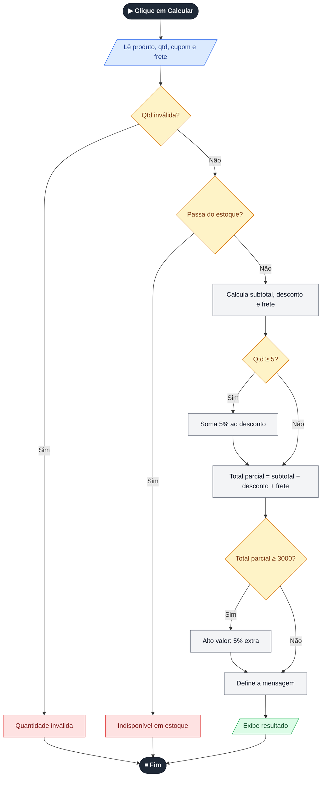
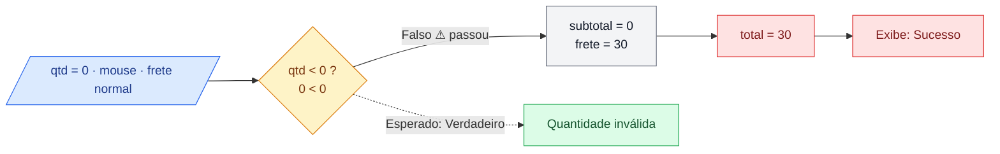
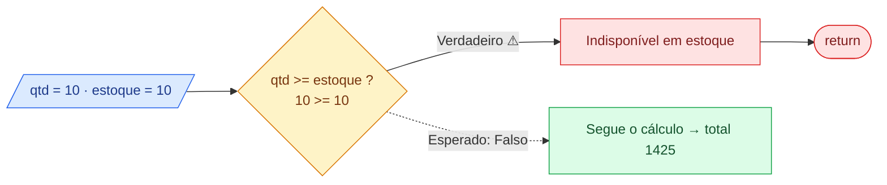
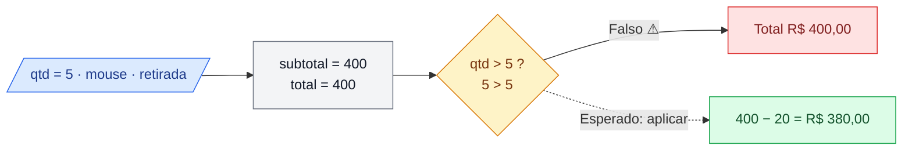
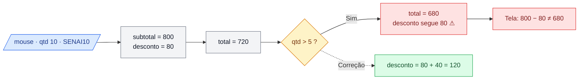
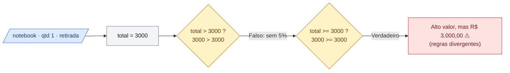
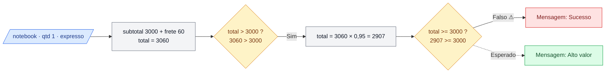

# Teste de Caixa Branca — Loja SENAI

| | |
|---|---|
| **Instituição** | SENAI |
| **Curso** | Técnico em Desenvolvimento de Sistemas |
| **Unidade curricular** | SESI CE 356 |
| **Atividade** | Teste de Caixa Branca |
| **Aluno** | Kaique Gonçalves Pavan |
| **Turma** | 3A |
| **Professores** | Robson, Reenye e Wellington |
| **Data** | 07/10/2026 |

> 📝 **Minhas anotações gerais**
>
> Fiz um teste de caixa branca e tive que analisar o código por dentro para encontrar onde estavam as inconsistências e entender por que alguns resultados não estavam saindo como deveriam.

---

## 1. O que é teste de caixa branca

No teste de caixa branca eu não fico olhando só para o resultado final. Eu entro no código e acompanho o que está acontecendo em cada parte. Vou passando pelos `if`, pelas comparações e pelos caminhos que o programa pode seguir para descobrir se a lógica está funcionando do jeito certo.

Esse tipo de teste é importante porque consegue encontrar erros que podem passar despercebidos durante o uso normal do sistema, principalmente quando trabalhamos com **valores-limite**, que são aqueles valores que ficam exatamente na borda de uma regra.

### O sistema

O sistema é uma página de loja onde o usuário escolhe **produto**, **quantidade**, **cupom** e **frete**. Depois ele clica em *Calcular pedido* e o sistema mostra o subtotal, o desconto, o frete e o valor total.

- `index.html`: estrutura da página
- `style.css`: parte visual da página
- `script.js`: lógica do sistema e cálculos, que é onde estavam os erros analisados

<details>
<summary><b>Código original (script.js)</b></summary>

```js
const precos = {
  notebook: 3000,
  mouse: 80,
  teclado: 150
};

const estoque = {
  notebook: 5,
  mouse: 20,
  teclado: 10
};

const produto = document.getElementById("produto");
const quantidade = document.getElementById("quantidade");
const cupom = document.getElementById("cupom");
const frete = document.getElementById("frete");
const calcular = document.getElementById("calcular");
const resultado = document.getElementById("resultado");

function calcularDesconto(subtotal, codigo) {
  if (codigo === "SENAI10") {
    return subtotal * 0.10;
  }

  if (codigo === "SENAI20" && subtotal >= 1000) {
    return subtotal * 0.20;
  }

  return 0;
}

function calcularFrete(tipo, subtotal) {
  if (tipo === "retirada") {
    return 0;
  }

  if (tipo === "expresso") {
    return 60;
  }

  if (subtotal >= 500) {
    return 0;
  }

  return 30;
}

function finalizarPedido() {
  const produtoSelecionado = produto.value;
  const qtd = Number(quantidade.value);
  const codigo = cupom.value.trim().toUpperCase();

  if (qtd < 0) {
    resultado.innerHTML = "<p>Quantidade inválida.</p>";
    return;
  }

  if (qtd >= estoque[produtoSelecionado]) {
    resultado.innerHTML = "<p>Quantidade indisponível em estoque.</p>";
    return;
  }

  const subtotal = precos[produtoSelecionado] * qtd;
  const desconto = calcularDesconto(subtotal, codigo);
  const valorFrete = calcularFrete(frete.value, subtotal);

  let total = subtotal - desconto + valorFrete;

  if (qtd > 5) {
    total = total - subtotal * 0.05;
  }

  if (total > 3000) {
    total = total * 0.95;
  }

  let mensagem = "Pedido calculado com sucesso.";

  if (total <= 0) {
    mensagem = "Valor do pedido inválido.";
  } else if (total >= 3000) {
    mensagem = "Pedido de alto valor.";
  }

  resultado.innerHTML = `
    <p>${mensagem}</p>
    <p>Subtotal: R$ ${subtotal.toFixed(2)}</p>
    <p>Desconto: R$ ${desconto.toFixed(2)}</p>
    <p>Frete: R$ ${valorFrete.toFixed(2)}</p>
    <p class="total">Total: R$ ${total.toFixed(2)}</p>
  `;
}

calcular.addEventListener("click", finalizarPedido);
```

</details>

---

## 2. Decisões do código

O código usa apenas `if`, sem `switch`, operador ternário ou laços. O único operador lógico usado é o `&&`, que aparece na condição do cupom SENAI20.

| # | Função | Condição | Verdadeiro / Falso |
|---|---|---|---|
| D1 | `calcularDesconto` | `codigo === "SENAI10"` | 10% / vai para D2 |
| D2 | `calcularDesconto` | `codigo === "SENAI20" && subtotal >= 1000` | 20% / sem desconto |
| D3 | `calcularFrete` | `tipo === "retirada"` | R$ 0 / vai para D4 |
| D4 | `calcularFrete` | `tipo === "expresso"` | R$ 60 / vai para D5 |
| D5 | `calcularFrete` | `subtotal >= 500` | R$ 0 / R$ 30 |
| D6 | `finalizarPedido` | `qtd < 0` | "Quantidade inválida" / vai para D7 |
| D7 | `finalizarPedido` | `qtd >= estoque` | "Indisponível" / segue o cálculo |
| D8 | `finalizarPedido` | `qtd > 5` | aplica 5% / não aplica |
| D9 | `finalizarPedido` | `total > 3000` | 5% extra / não aplica |
| D10 | `finalizarPedido` | `total <= 0` | "Valor inválido" / vai para D11 |
| D11 | `finalizarPedido` | `total >= 3000` | "Alto valor" / "Sucesso" |

---

## 3. Fluxograma geral



---

## 4. Casos de teste

| ID | Entrada | Condição / Caminho | Resultado esperado |
|---|---|---|---|
| CT01 | Mouse, qtd 0, sem cupom, normal | D6 no limite | "Quantidade inválida" |
| CT02 | Teclado, qtd 10, sem cupom, retirada | D7 no limite | Aceito, total R$ 1.425,00 |
| CT03 | Mouse, qtd 5, sem cupom, retirada | D8 no limite | Desconto R$ 20,00, total R$ 380,00 |
| CT04 | Mouse, qtd 10, SENAI10, retirada | D1 e D8 verdadeiros | Desconto R$ 120,00, total R$ 680,00 |
| CT05 | Notebook, qtd 1, sem cupom, retirada | D9 e D11 com total = 3000 | Alto valor, total R$ 2.850,00 |
| CT06 | Notebook, qtd 1, sem cupom, expresso | D9 verdadeiro e depois D11 | Alto valor, total R$ 2.907,00 |

---

## 5. Resultados

| Teste | Obtido (original) | Situação | Obtido (corrigido) | Situação |
|---|---|---|---|---|
| CT01 | "Sucesso", total R$ 30,00 | ❌ | "Quantidade inválida." | ✅ |
| CT02 | "Indisponível em estoque" | ❌ | Total R$ 1.425,00 | ✅ |
| CT03 | Total R$ 400,00, sem desconto | ❌ | Desconto R$ 20,00, total R$ 380,00 | ✅ |
| CT04 | Desconto R$ 80,00, total R$ 680,00 | ❌ | Desconto R$ 120,00, total R$ 680,00 | ✅ |
| CT05 | "Alto valor", total R$ 3.000,00 | ❌ | "Alto valor", total R$ 2.850,00 | ✅ |
| CT06 | "Sucesso", total R$ 2.907,00 | ❌ | "Alto valor", total R$ 2.907,00 | ✅ |

---

## 6. Análise dos erros

### 🔴 ERRO 1 · Fácil · valores-limite

**Trecho:** `if (qtd < 0)`

**Esperado:** quantidade 0, vazia ou decimal deve ser recusada.

**Teste:** mouse, qtd 0, sem cupom, frete normal.

**Caminho:** D6 `0 < 0` falso → D7 `0 >= 20` falso → subtotal 0 → D5 `0 >= 500` falso → frete 30 → total 30 → "Sucesso".

**Obtido:** o pedido é aceito com frete de R$ 30,00 mesmo tendo zero itens.

**Erro:** o limite está errado. O zero deveria ser considerado inválido, mas acaba passando pela condição.

**Correção:**

```js
if (!Number.isInteger(qtd) || qtd <= 0) {
```

**Depois:** "Quantidade inválida."



> 📝 **Minhas anotações — Erro 1:** 1 = coloquei qtd = 0 e mesmo assim o sistema continuava e cobrava o frete.

---

### 🔴 ERRO 2 · Fácil · valores-limite

**Trecho:** `if (qtd >= estoque[produtoSelecionado])`

**Esperado:** se existem 10 teclados em estoque, deve ser possível comprar os 10.

**Teste:** teclado (estoque 10), qtd 10, sem cupom, retirada.

**Caminho:** D6 falso → D7 `10 >= 10` verdadeiro → mostra "indisponível" e executa `return`.

**Obtido:** "Quantidade indisponível em estoque."

**Erro:** o `>=` acaba bloqueando uma compra que usa exatamente todo o estoque.

**Correção:**

```js
if (qtd > estoque[produtoSelecionado]) {
```

**Depois:** o pedido é aceito, com total de R$ 1.425,00. Com qtd 11, continua bloqueando normalmente.



> 📝 **Minhas anotações — Erro 2:** 2 = tinha 10 no estoque e não dava para comprar os 10, porque o sistema já bloqueava.

---

### 🟠 ERRO 3 · Médio · valores-limite e cobertura de decisões

**Trecho:** `if (qtd > 5)`

**Esperado:** aplicar 5% de desconto a partir de 5 unidades.

**Teste:** mouse, qtd 5, sem cupom, retirada.

**Caminho:** subtotal 400 → desconto 0 → frete 0 → total 400 → D8 `5 > 5` falso → sem desconto.

**Obtido:** total de R$ 400,00.

**Erro:** o `>` deixa a quantidade 5 de fora, mesmo sendo o valor que deveria iniciar a regra do desconto.

**Correção:**

```js
const QTD_MINIMA_DESCONTO = 5;

if (qtd >= QTD_MINIMA_DESCONTO) {
  desconto += subtotal * 0.05;
}
```

**Depois:** total de R$ 380,00. Com 4 unidades, continua sem desconto.



> 📝 **Minhas anotações — Erro 3:** 3 = o desconto tinha que começar quando a quantidade chegasse em 5, então era para usar maior ou igual a 5.

---

### 🟠 ERRO 4 · Médio · rastreamento de variáveis

**Trecho:**

```js
const desconto = calcularDesconto(subtotal, codigo);
let total = subtotal - desconto + valorFrete;

if (qtd > 5) {
  total = total - subtotal * 0.05;
}
```

**Esperado:** o desconto mostrado na tela deve considerar tanto o cupom quanto o desconto pela quantidade, para o valor exibido bater com a conta do total.

**Teste:** mouse, qtd 10, SENAI10, retirada.

**Caminho:** subtotal 800 → D1 verdadeiro, `desconto = 80` → total 720 → D8 verdadeiro, `total = 680` → a variável `desconto` continua em 80.

**Obtido:** desconto de R$ 80,00 e total de R$ 680,00. A conta não fecha, porque 800 − 80 = 720.

**Erro:** o desconto por quantidade altera diretamente o `total`, mas não atualiza a variável `desconto` que é mostrada na tela.

**Correção:**

```js
let desconto = calcularDesconto(subtotal, codigo);

if (qtd >= QTD_MINIMA_DESCONTO) {
  desconto += subtotal * 0.05;
}

const totalParcial = subtotal - desconto + valorFrete;
```

**Depois:** desconto de R$ 120,00 e total de R$ 680,00.



> 📝 **Minhas anotações — Erro 4:** 4 = era para somar o desconto da quantidade com o desconto do cupom e mostrar o valor certo para o usuário, mas na tela aparecia só o desconto do cupom.

---

### 🔴 ERRO 5 · Difícil · condições dependentes

**Trecho:**

```js
if (total > 3000) { total = total * 0.95; }

...

} else if (total >= 3000) { mensagem = "Pedido de alto valor."; }
```

**Esperado:** usar o mesmo limite para o desconto extra e para a mensagem. Neste teste, foi adotado "a partir de R$ 3.000".

**Teste:** notebook, qtd 1, sem cupom, retirada (total = 3000).

**Caminho:** D9 `3000 > 3000` falso, então não aplica os 5% → D10 falso → D11 `3000 >= 3000` verdadeiro → aparece "Alto valor".

**Obtido:** "Pedido de alto valor." com total de R$ 3.000,00, mas sem receber o desconto esperado.

**Erro:** as duas decisões estão usando o mesmo limite de formas diferentes: uma usa `>` e a outra usa `>=`.

**Correção:**

```js
const LIMITE_ALTO_VALOR = 3000;
const altoValor = totalParcial >= LIMITE_ALTO_VALOR;
```

**Depois:** aparece "Pedido de alto valor." e o total fica em R$ 2.850,00.



> 📝 **Minhas anotações — Erro 5:** 5 = quando colocava 3000, o sistema dizia que era um pedido de alto valor, mas não aplicava o desconto porque o desconto estava usando `> 3000`.

---

### 🔴 ERRO 6 · Difícil · análise de caminhos

**Trecho:** os mesmos `if (total > 3000)` e `else if (total >= 3000)` analisados no erro 5.

**Esperado:** classificar como alto valor olhando o valor antes do desconto que essa própria condição gera.

**Teste:** notebook, qtd 1, sem cupom, frete expresso.

**Caminho:** subtotal 3000 → frete 60 → total 3060 → D9 `3060 > 3000` verdadeiro → total vira 2907 → D11 `2907 >= 3000` falso → aparece "Sucesso".

**Obtido:** "Pedido calculado com sucesso." com total de R$ 2.907,00.

**Erro:** o problema está na ordem das operações. O `total` é alterado pelo desconto e depois é usado novamente para decidir a mensagem. Isso pode acontecer com pedidos que ficam entre R$ 3.000,00 e aproximadamente R$ 3.157,89.

**Correção:** primeiro decidir se o pedido é de alto valor e só depois alterar o total.

```js
const altoValor = totalParcial >= LIMITE_ALTO_VALOR;
const descontoAltoValor = altoValor ? totalParcial * 0.05 : 0;
const total = totalParcial - descontoAltoValor;

if (total <= 0) {
  mensagem = "Valor do pedido inválido.";
} else if (altoValor) {
  mensagem = "Pedido de alto valor.";
}
```

**Depois:** aparece "Pedido de alto valor." com total de R$ 2.907,00.



> 📝 **Minhas anotações — Erro 6:** 6 = quando o produto recebe o frete, ele passa a ser um pedido de alto valor, mas depois do desconto o sistema usa o novo total e acaba mostrando apenas "pedido calculado com sucesso".

---

## 7. Antes e depois

| Erro | Nível | Antes | Depois |
|---|---|---|---|
| 1 | Fácil | Aceita qtd 0 e cobra frete | Recusa 0, vazio e decimais |
| 2 | Fácil | Bloqueia pedido igual ao estoque | Aceita até o estoque |
| 3 | Médio | 5 unidades sem desconto | Desconto a partir de 5 |
| 4 | Médio | Desconto da tela não fecha com o total | Desconto soma cupom + quantidade |
| 5 | Difícil | `>` e `>=` divergem em 3000 | Mesmo limite nas duas decisões |
| 6 | Difícil | Perde "alto valor" após o desconto | Classificação feita antes do desconto |

**Cobertura:** os seis casos passam por D1, D6, D7, D8, D9, D10 (lado falso), D11 (os dois lados) e parte da condição composta D2. Ainda vale testar o SENAI20 acima e abaixo de R$ 1.000, o frete normal acima e abaixo de R$ 500 e um cupom inexistente.

### Código corrigido (`finalizarPedido`)

O código completo está no arquivo [`scriptnovo.js`](./scriptnovo.js).

```js
const LIMITE_ALTO_VALOR = 3000;
const QTD_MINIMA_DESCONTO = 5;

function finalizarPedido() {
  const produtoSelecionado = produto.value;
  const qtd = Number(quantidade.value);
  const codigo = cupom.value.trim().toUpperCase();

  if (!Number.isInteger(qtd) || qtd <= 0) {
    resultado.innerHTML = "<p>Quantidade inválida.</p>";
    return;
  }

  if (qtd > estoque[produtoSelecionado]) {
    resultado.innerHTML = "<p>Quantidade indisponível em estoque.</p>";
    return;
  }

  const subtotal = precos[produtoSelecionado] * qtd;
  let desconto = calcularDesconto(subtotal, codigo);

  if (qtd >= QTD_MINIMA_DESCONTO) {
    desconto += subtotal * 0.05;
  }

  const valorFrete = calcularFrete(frete.value, subtotal);
  const totalParcial = subtotal - desconto + valorFrete;

  const altoValor = totalParcial >= LIMITE_ALTO_VALOR;
  const descontoAltoValor = altoValor ? totalParcial * 0.05 : 0;

  const total = totalParcial - descontoAltoValor;

  let mensagem = "Pedido calculado com sucesso.";

  if (total <= 0) {
    mensagem = "Valor do pedido inválido.";
  } else if (altoValor) {
    mensagem = "Pedido de alto valor.";
  }

  resultado.innerHTML = `
    <p>${mensagem}</p>
    <p>Subtotal: R$ ${subtotal.toFixed(2)}</p>
    <p>Desconto: R$ ${desconto.toFixed(2)}</p>
    ${altoValor ? `<p>Desconto alto valor: R$ ${descontoAltoValor.toFixed(2)}</p>` : ""}
    <p>Frete: R$ ${valorFrete.toFixed(2)}</p>
    <p class="total">Total: R$ ${total.toFixed(2)}</p>
  `;
}
```

---

## 8. Conclusão
>
> - Um código pode rodar normalmente e mesmo assim estar errado. Nos 6 casos testados, o sistema mostrava resultados que pareciam normais, mas a lógica estava errada.
>
> - A maior parte dos problemas estava nos **valores-limite**, principalmente no uso de `<`, `>` e `>=`.
>
> - Também encontrei um problema em que o desconto mostrado na tela não era o mesmo desconto usado para chegar ao total.
>
> - Outro problema foi a ordem das operações, porque uma decisão alterava o valor que seria usado na decisão seguinte.
>
> - O fluxograma ajudou bastante a entender esses caminhos e ver onde o sistema estava tomando uma decisão diferente do esperado.
>
> - Depois das correções, os 6 casos que falhavam passaram a apresentar os resultados esperados.
